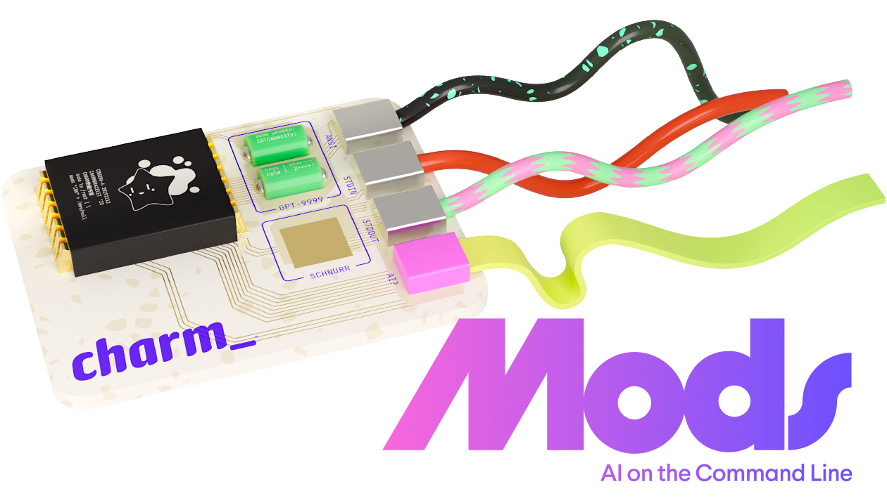

> [!NOTE]
> #### Actively Maintained Fork
>
> The original Mods was [sunset by Charm](https://github.com/charmbracelet/mods) on
> March 9, 2026. **This fork** is actively maintained with new features and fixes.
>
> See [What's New](#whats-new) for a list of additions since forking.

# Mods

<p>
    
    <br>
    <a href="https://github.com/panjie/mods/actions"></a>
</p>

AI for the command line, built for pipelines.

<p></p>

Large Language Models (LLM) based AI is useful to ingest command output and
format results in Markdown, JSON, and other text based formats. Mods is a
tool to add a sprinkle of AI in your command line and make your pipelines
artificially intelligent.

It works with [OpenAI], [Anthropic], [Gemini], [Cohere], [Azure OpenAI],
[DeepSeek], [OpenRouter], and local [Ollama] models. You can also add
[LocalAI], [Groq], or any OpenAI-compatible endpoint in `mods.yml`.

[OpenAI]: https://platform.openai.com/account/api-keys
[Anthropic]: https://console.anthropic.com/settings/keys
[Gemini]: https://aistudio.google.com/apikey
[Cohere]: https://dashboard.cohere.com/api-keys
[Azure OpenAI]: https://azure.microsoft.com/en-us/products/cognitive-services/openai-service
[DeepSeek]: https://platform.deepseek.com/api_keys
[OpenRouter]: https://openrouter.ai/settings/keys
[Ollama]: https://ollama.com
[LocalAI]: https://github.com/mudler/LocalAI
[Groq]: https://console.groq.com/keys

### Installation

#### Build from source

Requires Go 1.25 or newer.

```sh
git clone https://github.com/panjie/mods.git
cd mods
make build
```

This writes the binary to `bin/mods`. Add it to your `PATH` for easy access:

```sh
export PATH="$PWD/bin:$PATH"
```

To install the compiled binary and manpage into system locations, run:

```sh
make install
```

On macOS and Linux this installs to `/usr/local/bin/mods` and
`/usr/local/share/man/man1/mods.1.gz`. On Windows, the default location is
`C:\Program Files\mods\bin\mods.exe` and
`C:\Program Files\mods\share\man\man1\mods.1`.

You can override the install prefix or package into a staging directory:

```sh
make install PREFIX=/opt/local
make install DESTDIR=/tmp/pkgroot PREFIX=/usr/local
```

For user-local installs that follow XDG-style paths on macOS and Linux, use:

```sh
make install XDG=1
```

This installs to `${HOME}/.local/bin/mods` and
`${XDG_DATA_HOME:-$HOME/.local/share}/man/man1/mods.1.gz`. Because XDG does not
define a binary directory, Mods also honors `XDG_BIN_HOME`:

```sh
make install XDG=1 XDG_BIN_HOME="$HOME/.local/bin" XDG_DATA_HOME="$HOME/.local/share"
```

On Windows, `XDG=1` is strict: both `XDG_BIN_HOME` and `XDG_DATA_HOME` must be
set explicitly, otherwise `make install` fails with a clear error.

```powershell
make install XDG=1 XDG_BIN_HOME="C:/Users/Alice/.local/bin" XDG_DATA_HOME="C:/Users/Alice/.local/share"
```

Remove installed files with:

```sh
make uninstall
make uninstall XDG=1
```

Use `make check` to verify the project compiles, and `make test` to run the test suite. The `dist/` directory is reserved for GoReleaser release and snapshot artifacts.

#### Install with `go`

Direct `go install` is not currently documented for this fork because `go.mod`
still uses the upstream module path (`github.com/charmbracelet/mods`). Use the
source build above until the fork's module path is moved or release binaries are
published.

#### Download binaries

Pre-built packages and binaries are not published for this fork yet. When
release artifacts are available, they will appear on the [releases] page.

[releases]: https://github.com/panjie/mods/releases

<details>
<summary>Shell Completions</summary>

Release archives, when published, may include pre-generated completion files for
Bash, ZSH, Fish, and PowerShell.

If you built from source, you can generate completion scripts with:

```bash
mods completion bash > mods.bash
mods completion zsh > _mods
mods completion fish > mods.fish
mods completion powershell > mods.ps1
```

</details>

## What's New

This fork adds the following features on top of the original Mods.

### Tools & Agents

- **Web Search** — `--web-search` enables real-time web search (DuckDuckGo default,
  no API key required). Also supports Tavily and custom providers.
- **Image Recognition** — `-i` / `--image` attaches images for vision-capable
  models. `--clipboard-image` and `--stdin-image` attach clipboard and piped
  image input.
- **Built-in Tools** — File system operations (`fs_read_file`, `fs_write_file`,
  `fs_search`, `fs_apply_patch`), shell execution (`shell_run`, plus
  `powershell_run` on Windows), and sequential thinking (`thinking_note`).
  Filesystem tools auto-activate when your prompt mentions files; shell and
  sequential thinking tools are disabled by default and can be enabled in
  `builtin-tools` in `mods.yml`.

### Review & Safety

- **Tool Execution Review** — Before modifying files or running shell commands,
  Mods shows a colored confirmation banner. Press `Y` to approve once, `N` to
  deny, or `A` to save the displayed rule for the current conversation. Shell
  rules use command prefixes; file-edit rules cover future edits in that
  conversation. Saved rules are restored with `--continue`. `--review` controls the mode:
  `mutable` (default), `always`, or `never`.

  ```
  Review: Run: git commit -m "Update docs"
  [Y] Approve  [N] Deny  [A] Always allow: shell_run(git commit *)  [Ctrl+C] Cancel
  ```

### Observability

- **Debug Mode** — `--debug` / `-D` prints execution steps, tool calls, reasoning
  thoughts, and API diagnostics to stderr.
- **Status Line** — Live status bar shows what the model is doing: "Reading file:
  ...", "Running command: ...", "Searching web: ...".

### Quality of Life

- **Reasoning Mode** — `--reasoning on|off|auto`: auto mode judges task complexity
  before engaging deep reasoning (saves tokens for simple queries).
- **Minimal Pipeline Output** — `--minimal` tells the model to skip explanations
  and output one item per line, optimized for `|` pipelines.
- **Tool Round Limits** — `--max-tool-rounds` caps total tool call rounds (default
  30) with separate failed-round limiting to prevent infinite loops.
- **Updated Models** — Model list refreshed across OpenAI, Anthropic, Google,
  Cohere, DeepSeek, OpenRouter, and Ollama.

### Cross-Platform

- **Windows** — Console popup suppression, clipboard support, platform-specific
  command execution.
- **Stability** — 413/token overflow prevention, MCP timeout handling, session
  error recovery.

## What Can It Do?

Mods works by reading standard in and prefacing it with a prompt supplied in
the `mods` arguments. It sends the input text to an LLM and prints out the
result, optionally asking the LLM to format the response as Markdown. This
gives you a way to "question" the output of a command. Mods will also work on
standard in or an argument supplied prompt individually.

Be sure to check out the [examples](examples.md) and a list of all the
[features](features.md).

Mods ships with configuration for OpenAI, Anthropic, Google Gemini, Cohere,
Azure OpenAI, DeepSeek, OpenRouter, and Ollama. You can configure LocalAI, Groq,
or any other OpenAI-compatible endpoint in your settings file by running
`mods --settings`.

## Saved Conversations

Conversations are saved locally by default. Each conversation has a SHA-1
identifier and a title (like `git`!).

<p>
  
</p>

Check the [`./features.md`](./features.md) for more details.

## Pipeline-Friendly Output

Use `--minimal` when another command needs to consume the answer directly. It tells the model to skip explanations and print list results one item per line.

```sh
ls -l | mods --minimal "pick the biggest five file names" | gum choose
```

## Usage

Run `mods --help` for generated help. Current options include:

#### Model & API

- `-a`, `--api`: API profile to use (`openai`, `anthropic`, `google`, `cohere`, `ollama`, custom profiles, etc.)
- `-m`, `--model`: Model to use
- `-M`, `--ask-model`: Ask which model to use via interactive prompt
- `-x`, `--http-proxy`: HTTP proxy for API requests
- `--max-retries`: Maximum number of API call retries
- `--max-tokens`: Maximum number of response tokens
- `--no-limit`: Disable the client-side input size limit
- `--stop`: Stop sequence; can be specified multiple times
- `--temp`: Sampling temperature (`-1.0` disables when supported)
- `--topp`: Top P sampling value (`-1.0` disables when supported)
- `--topk`: Top K sampling value (`-1` disables when supported)

#### Input & Output

- `-f`, `--format`: Ask for formatted output, Markdown by default
- `--format-as`: Inline format prompt to use with `--format`
- `--minimal`: Output only the final result, optimized for pipelines
- `-P`, `--prompt`: Include the prompt from arguments and stdin; optionally truncate stdin to the specified number of lines
- `-p`, `--prompt-args`: Include prompt arguments in the response
- `-q`, `--quiet`: Hide the spinner and success messages on stderr
- `--hide-tool-status`: Hide the bottom status line while tools are running
- `-r`, `--raw`: Render raw text when connected to a TTY
- `--word-wrap`: Wrap formatted output at a width, default `80`
- `--status-text`: Text to show while generating
- `--workspace`: Workspace root for filesystem and shell tools

#### Configuration & UI

- `--settings`: Open settings in `$EDITOR`
- `--dirs`: Print data/config directories used by Mods
- `--reset-settings`: Back up the old settings file and reset to defaults
- `--theme`: Form theme; valid choices are `charm`, `catppuccin`, `dracula`, and `base16`
- `--fanciness`: Desired level of fanciness
- `-e`, `--editor`: Edit the prompt in `$EDITOR` when there are no args and stdin is a TTY
- `-h`, `--help`: Show help and exit
- `-v`, `--version`: Show version and exit

#### Roles

- `-R`, `--role`: System role to use; see [custom roles](#custom-roles)
- `--list-roles`: List roles defined in your configuration file

#### Image Support

- `-i`, `--image`: Attach one or more images to the prompt (supports png, jpg, gif, webp). Can be specified multiple times or as comma-separated paths
- `--stdin-image`: Treat piped stdin input as raw image data instead of text
- `--clipboard-image`: Attach the current image in the system clipboard to the prompt

#### Web Search

- `--web-search`: Enable web search for up-to-date information (uses DuckDuckGo by default)
- `--web-search-provider`: Web search provider (`duckduckgo`, `tavily`, or a custom provider URL)
- `--web-search-api-key`: API key for the web search provider (required for Tavily)

#### Conversations

- `-t`, `--title`: Set the title for the conversation.
- `-l`, `--list`: List saved conversations.
- `-c`, `--continue`: Continue from last response or specific title or SHA-1.
- `-C`, `--continue-last`: Continue the last conversation.
- `-s`, `--show`: Show saved conversation for the given title or SHA-1
- `-S`, `--show-last`: Show previous conversation
- `-d`, `--delete`: Deletes saved conversations for the given titles or SHA-1s
- `--delete-older-than=<duration>`: Deletes conversations older than given duration (`10d`, `1mo`)
- `--no-cache`: Do not save conversations

#### Built-In Tools

Filesystem tools are `auto` by default. Shell and sequential thinking tools must
be enabled explicitly in `mods.yml`:

```yaml
builtin-tools:
  filesystem: auto  # auto, true, or false
  shell: true
  sequential-thinking: true
  shell-timeout: 30s
  shell-max-output: 20000
  workspace-root: ""
```

#### Review & Safety

- `-V`, `--review`: Set review mode: `mutable` (default, reviews file writes and shell commands), `always` (reviews all tools), or `never` (disables review). Also configurable via `MODS_REVIEW_MODE` env var or `review-mode` in `mods.yml`.
- `--max-tool-rounds`: Maximum total tool call rounds before stopping (default 30)

```bash
# Review all tool executions
mods --review always "rename the fn to calculateTotal"
# Disable review entirely
mods --review never "list go files"
```

#### Reasoning & Debug

- `-T`, `--reasoning`: Deep reasoning mode: `off`, `on`, or `auto` (judges task complexity before engaging, saves tokens on simple queries)
- `-D`, `--debug`: Print execution steps, tool calls, and request diagnostics to stderr

#### MCP

- `--mcp-list`: List all available MCP servers
- `--mcp-list-tools`: List all available tools from enabled MCP servers
- `--mcp-disable`: Disable specific MCP servers
- `--mcp-enable`: Enable only specific MCP servers (whitelist, overrides disable list)

## Custom Roles

Roles allow you to set system prompts. Here is an example of a `shell` role:

```yaml
roles:
  shell:
    - you are a shell expert
    - you do not explain anything
    - you simply output one liners to solve the problems you're asked
    - you do not provide any explanation whatsoever, ONLY the command
```

Then, use the custom role in `mods`:

```sh
mods --role shell list files in the current directory
```

## Setup

Run `mods --settings` to create or edit `mods.yml`. The default configuration
uses the OpenAI API with `gpt-5`:

```yaml
default-api: openai
default-model: gpt-5
```

### OpenAI

Set the `OPENAI_API_KEY` environment variable. If you don't have one yet, get it
from the [OpenAI website](https://platform.openai.com/account/api-keys).

### Anthropic

Anthropic models are configured under the `anthropic` API profile. Set the
`ANTHROPIC_API_KEY` environment variable. If you don't have one yet, get it from
the [Anthropic console](https://console.anthropic.com/settings/keys).

```sh
mods --api anthropic --model claude-sonnet-4-20250514 "explain this error"
```

### Google Gemini

Gemini models are configured under the `google` API profile. Set the
`GOOGLE_API_KEY` environment variable. If you don't have one yet, get it from
[Google AI Studio](https://aistudio.google.com/apikey).

```sh
mods --api google --model gemini-2.5-pro "summarize this"
```

### Azure OpenAI

Set the `AZURE_OPENAI_KEY` environment variable and update the `azure` profile in
`mods.yml` with your Azure OpenAI resource URL and deployed model names. Grab a
key from [Azure](https://azure.microsoft.com/en-us/products/cognitive-services/openai-service).

### Cohere

Cohere provides enterprise optimized models.

Set the `COHERE_API_KEY` environment variable. If you don't have one yet, you can
get it from the [Cohere dashboard](https://dashboard.cohere.com/api-keys).

### DeepSeek

DeepSeek is configured as an OpenAI-compatible endpoint under the `deepseek` API
profile. Set `DEEPSEEK_API_KEY` and choose one of the configured DeepSeek models
or aliases.

```sh
mods --api deepseek --model deepseek-chat "write release notes"
```

### OpenRouter

OpenRouter is configured under the `openrouter` API profile. Set
`OPENROUTER_API_KEY` and select one of the configured OpenRouter model IDs or
aliases.

```sh
mods --api openrouter --model or-sonnet-4 "review this diff"
```

### Ollama

Ollama is configured under the `ollama` API profile with `http://localhost:11434`
as the default base URL. Start Ollama locally and use one of the configured model
names or aliases.

```sh
mods --api ollama --model llama3.3 "summarize this log"
```

### LocalAI, Groq, And Other OpenAI-Compatible APIs

LocalAI, Groq, and other OpenAI-compatible providers can be added as custom API
profiles in `mods.yml`:

```yaml
apis:
  groq:
    base-url: https://api.groq.com/openai/v1
    api-key-env: GROQ_API_KEY
    models:
      llama-3.3-70b-versatile:
        aliases: ["groq-llama"]
        max-input-chars: 120000
```

### Web Search

Mods can search the web to provide up-to-date information in responses. DuckDuckGo is the default provider and requires no API key.

```bash
# Enable web search
mods --web-search "What's the latest Go version?"
```

**Tavily** provides AI-optimized search results. Set your API key:

```bash
export MODS_WEB_SEARCH_PROVIDER=tavily
export MODS_WEB_SEARCH_API_KEY=tvly-xxxxxxxxxxxxx
```

**Custom providers** are supported via a base URL pointing to a compatible search API:

```bash
mods --web-search --web-search-provider=https://your-search-api.example.com "query"
```

## Contributing

Issues and pull requests are welcome on this fork.

## License

[MIT](https://github.com/panjie/mods/raw/main/LICENSE)
