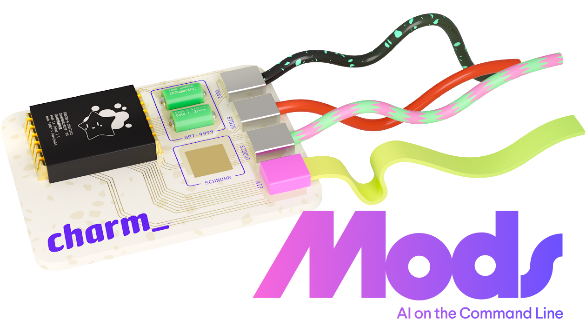

> [!NOTE]
> #### Actively Maintained Fork
>
> The original Mods was [sunset by Charm](https://github.com/charmbracelet/mods) on
> March 9, 2026. **This fork** is actively maintained with new features and fixes.

# Mods

<p>
    
    <br>
    <a href="https://github.com/panjie/mods/actions"></a>
</p>

An AI agent for your terminal. Mods doesn't just answer questions — it can read
and edit your files, run shell commands, search the web, and iterate across many
tool calls to actually finish a task. A built-in review step keeps you in charge
of anything risky before it happens.

It works with [OpenAI], [Anthropic], [Gemini], [Azure OpenAI],
[DeepSeek], [GLM], [Qwen], [Kimi], [MiniMax], [OpenRouter], and local
[Ollama] models. Any OpenAI-compatible endpoint can be added in `mods.yml`.

[OpenAI]: https://platform.openai.com/account/api-keys
[Anthropic]: https://console.anthropic.com/settings/keys
[Gemini]: https://aistudio.google.com/apikey
[Azure OpenAI]: https://azure.microsoft.com/en-us/products/cognitive-services/openai-service
[DeepSeek]: https://platform.deepseek.com/api_keys
[OpenRouter]: https://openrouter.ai/settings/keys
[Ollama]: https://ollama.com
[GLM]: https://open.bigmodel.cn/
[Qwen]: https://dashscope.console.aliyun.com/
[Kimi]: https://platform.moonshot.cn/
[MiniMax]: https://www.minimaxi.com/

<p></p>

## What Mods Can Do

- **Act, don't just talk.** With built-in tools enabled, Mods inspects and edits
  files, runs shell commands, and chains multiple tool calls together to complete
  a task end-to-end.
- **Safety first.** Every file write and shell command passes through a review
  prompt. Approve once, deny, or save a per-session rule. Prefer to see a
  plan before anything runs? Use `--plan`.
- **Stays in your pipeline.** Pipe command output in, get structured answers out.
  `--minimal` prints one item per line — perfect for `| gum choose` and friends.
- **Knows the live web.** Web search is opt-in; `--web-search` uses a supported
  provider's hosted search when available, otherwise Tavily or a custom backend.
- **Sees images.** Attach pictures via `--image`, `--clipboard-image`, or piped
  stdin for any vision-capable model.
- **Remembers.** Every session is saved locally with a title and a SHA-1 —
  list, resume, show, or delete with simple flags.
- **Plays well with others.** Connect external capabilities through [MCP] servers,
  or define reusable system prompts as [custom roles].

[MCP]: https://modelcontextprotocol.io

## Quick Start

### Install

```sh
brew install panjie/tap/mods
```

Or, with Go 1.25+:

```sh
go install github.com/panjie/mods@latest
```

<details>
<summary>Other ways to install</summary>

Build from source with [Task](https://taskfile.dev):

```sh
git clone https://github.com/panjie/mods.git
cd mods
go run github.com/go-task/task/v3/cmd/task@v3.51.1 build        # binary lands in bin/mods
go run github.com/go-task/task/v3/cmd/task@v3.51.1 install      # installs to ~/.local/bin/mods (or $XDG_BIN_HOME)
```

The `install` task honors `PREFIX`, `BINDIR`, `DESTDIR`, and `XDG_BIN_HOME`.
On all platforms the default install path is `$HOME/.local/bin/mods` (`mods.exe` on Windows).

Prebuilt Windows portable ZIPs are published on the [releases] page.
The latest nightly build is published as the [nightly prerelease].

[releases]: https://github.com/panjie/mods/releases
[nightly prerelease]: https://github.com/panjie/mods/releases/tag/nightly

Generate shell completions:

```sh
mods completion bash > mods.bash
mods completion zsh > _mods
mods completion fish > mods.fish
mods completion powershell > mods.ps1
```

</details>

### Configure

Run the interactive setup wizard to pick a provider, model, and API key:

```sh
mods --config
```

The wizard walks you through provider and model selection, API key entry,
built-in tools, and review mode — then saves everything to `mods.yml`
automatically.

The standard config path is `$XDG_CONFIG_HOME/mods/mods.yml`, or
`$HOME/.config/mods/mods.yml` when `XDG_CONFIG_HOME` is unset. If a `mods.yml`
file exists next to the executable, portable mode uses that file instead.
Sessions are stored in `$XDG_DATA_HOME/mods/sessions`, or
`$HOME/.local/share/mods/sessions` when `XDG_DATA_HOME` is unset.

On first real use, if `mods.yml` does not exist and there are no saved
sessions, Mods starts this setup wizard automatically. Help, version,
completion, directory, settings, config, list, show, delete, role listing, and
MCP listing commands do not trigger first-run setup.

Prefer to edit the raw YAML? Open it in your `$EDITOR`:

```sh
mods --settings
```

You can also recursively merge a YAML mapping into `mods.yml` directly from
the command line. Existing values at the same path are overwritten, while
unmentioned settings are preserved:

```sh
mods --settings 'default-api: openai'

mods --settings 'apis:
  fujitsu-google:
    api-type: google
    base-url: https://abc.com
    api-key-env: FUJITSU_GOOGLE_API_KEY
    models:
      gemini-3.0-pro: {}'
```

The `--settings='<yaml>'` spelling is also supported. Avoid passing `api-key`
values directly because command arguments may be recorded in shell history or
visible to other local processes; prefer `api-key-env`.

Set a provider and model with the interactive wizard, or edit the YAML directly:

```yaml
default-api: openai
default-model: gpt-5.4
apis:
  openai:
    api-key-env: OPENAI_API_KEY
    models:
      gpt-5.4: {}
```

```sh
export OPENAI_API_KEY=sk-...
```

### First run

```sh
# Summarize piped output
git log --oneline -20 | mods -f "group these commits by theme"

# Let Mods read and edit files in the current directory
mods --workspace . "read README.md and suggest three improvements"

# See a plan before any change is applied
mods --plan --workspace . "extract the CLI examples into a separate doc"
```

## See It In Action

### Review code

```sh
# Review uncommitted changes before pushing
git diff | mods -f "review this diff — flag bugs, security issues, and naming problems"
```

### Modernize & refactor

```sh
# Bring your vim config in line with current community best practices
mods --workspace "$HOME" --plan "modernize my .vimrc to the most popular 2026 setup, but preserve my keybindings"

# Migrate a codebase from one library to another
mods "replace all requests usage with httpx, keep behavior identical"

# Sweep the repo for stale patterns
mods "find every console.log and replace it with the structured logger"
```

### Debug & understand

```sh
# Diagnose why tests are failing
go test ./... 2>&1 | mods "explain each failure and suggest the likely fix"

# Make sense of a messy log tail
journalctl -u myapp --since "1h ago" | mods "what went wrong in the last hour?"

# Get up to speed on an unfamiliar codebase
mods "read internal/tools and explain how a tool call flows end-to-end"
```

### Generate & scaffold

```sh
# Draft a changelog from recent commits
git log v1.0.0..HEAD --oneline | mods "write a user-facing changelog grouped by theme"

# Add tests for the most important untested functions
mods "find Go functions without tests and add table-driven tests for the top 5"

# Collect every TODO into a prioritized report
mods "scan for TODO/FIXME comments and write prioritized TODO-report.md"
```

### Pipelines & quick answers

```sh
# Pick from a list using pipeline-friendly output
find . -maxdepth 1 -type f | sort | mods --minimal "pick the five most important files" | gum choose

# Ask the live web, then act on the answer
export TAVILY_API_KEY="tvly-..."
mods --web-search "what changed in the latest Go release? update go.mod if relevant"

# Force local Tavily/custom search even when the model offers hosted search
mods --web-search --web-search-backend local "find the latest Go release"

# Ask a vision-capable model about an image
mods --image assets/mods-product.png "suggest alt text for this image"
mods -I "describe the image on my clipboard"

# Save and resume sessions
mods "draft v1.1 release notes from CHANGELOG.md"
mods --continue-last "turn those into a Twitter thread"
mods --list-sessions

# Start a continuous session
mods --chat
mods --chat --continue-last
```

The session browser supports transcript search: open a session, press `/` to
find text, use `n`/`N` to move between matches, and press `w` to toggle wrapping
for code, logs, and tables.

Use `--chat` for a terminal-native conversation when one prompt is not enough.
The inline composer supports multi-line prompts: press `Enter` to send and
`Ctrl+J` to add a new line. Press `Ctrl+C` while composing to leave. Each turn
is saved to the same session so you can resume it later with `--continue`.

## Safety & Review

Mods asks for confirmation before any file write or shell command runs. You
always see exactly what will execute, and you choose what happens next:

```
Review: Run: rm -f /path/to/workspace/demo.gif
[Y] Approve  [N] Deny  [A] Always allow  [Ctrl+C] Cancel
Always allows writes in /path/to/workspace
```

- `Y` — approve this one call
- `N` — deny; Mods gets the failure and can react
- `A` — save a per-session rule for the current workspace so similar calls skip the prompt from now on
- `Ctrl+C` — cancel the whole run

Pick the mode that fits the task with `-V` / `--review-mode` (or `review-mode` in
`mods.yml`, or the `MODS_REVIEW_MODE` env var). Use `-N` / `--no-review` as a
shortcut for `--review-mode=never`:

| Mode       | Behavior                                                          |
|------------|-------------------------------------------------------------------|
| `auto`     | Default. Reviews file writes and shell commands flagged as risky. |
| `always`   | Reviews **every** tool call, including reads and searches.        |
| `never`    | Disables review entirely. Use only for trusted, automated runs.   |

Want a heads-up before any tool fires at all? `--plan` makes Mods draft a
step-by-step plan for your approval first, then executes once you accept.

```sh
mods --review-mode always "rename the fn to calculateTotal across the repo"
mods --plan "refactor the examples to cover more features"
```

## Built-in Tools & MCP

Mods ships with native tools that auto-activate when your prompt needs them:

| Tool                 | What it does                                              |
|----------------------|-----------------------------------------------------------|
| `fs_read_file`       | Read UTF-8 files (with offset/limit for large files).     |
| `fs_write_file`      | Create or overwrite files in the workspace.               |
| `fs_replace`         | Replace exact text in an existing file.                   |
| `fs_search`          | Search file contents across the workspace.                |
| `fs_apply_patch`     | Atomically apply unified or Codex-format multi-file edits. |
| `process_run`        | Execute one program with literal argv and structured output. |
| `shell_run`          | Execute shell commands (prefix-allowable through review). |
| `runtime_info`       | Inspect the selected shell and resolve command availability. |

Filesystem tools default to `auto`; shell is enabled by default. Toggle them in
`mods.yml`:

```yaml
builtin-tools:
  filesystem: auto          # auto, true, or false
  shell: true
  shell-timeout: 30s
  workspace: ""             # defaults to the current working directory
```

Pass `--workspace` to scope filesystem and shell tools to a project workspace. The
status line at the bottom shows what Mods is doing between tool calls
("Reading file: ...", "Running command: ...", "Searching web: ..."). Hide it
with `--hide-tool-status`, which also suppresses the compact one-line record
each completed tool call leaves in normal output (for example
`> ✓ shell_run: ls -la · exit 0`).
Shell paths that still depend on runtime expansion (for example PowerShell's
`$PROFILE` or another variable) are shown as dynamic targets and can only be
approved once; they are never saved as directory rules. For a reusable scoped
approval, resolve the path first and use its literal absolute value in the
mutation command.
Mods also performs a bounded reviewability preflight for model-generated shell
calls. When a call unnecessarily wraps one executable in a shell, mixes
inspection and mutation, writes through a runtime path, or combines several
independent actions, the model receives one request to retry with smaller calls
before anything runs. This correction happens at most once per request and does
not replace the normal safety review; a legitimate complex command can still
proceed to review on the next attempt. Pipelines that represent one operation
are not split automatically.
Use `--show-token-usage` (or `-s`) to print the input, output, and total token count for
an interaction to stderr without mixing it into the model response on stdout.

### MCP

Connect external tools and data sources through Model Context Protocol servers
configured under `mcp-servers` in `mods.yml`:

```yaml
mcp-servers:
  github:
    command: docker
    env:
      - GITHUB_PERSONAL_ACCESS_TOKEN=xxxyyy
    args:
      - run
      - "-i"
      - "--rm"
      - "-e"
      - GITHUB_PERSONAL_ACCESS_TOKEN
      - "ghcr.io/github/github-mcp-server"
```

Inspect what's available with `mods --list-mcps` and `mods --list-tools`.

## Supported Providers

Mods is configured for the providers below out of the box. The easiest way to
get started is `mods --config` — it walks you through picking a provider, model,
and API key interactively. You can also set the matching environment variable
manually and select a model with `--api` and `--model`.

| Provider     | `--api` value  | Env var                      | Get a key                                     |
|--------------|----------------|------------------------------|-----------------------------------------------|
| OpenAI       | `openai`       | `OPENAI_API_KEY`             | [platform.openai.com][OpenAI]                 |
| Anthropic    | `anthropic`    | `ANTHROPIC_API_KEY`          | [console.anthropic.com][Anthropic]            |
| Google       | `google`       | `GOOGLE_API_KEY`             | [aistudio.google.com][Gemini]                 |
| Azure OpenAI | `azure`        | `AZURE_OPENAI_KEY`           | [azure.microsoft.com][Azure OpenAI]           |
| DeepSeek     | `deepseek`     | `DEEPSEEK_API_KEY`           | [platform.deepseek.com][DeepSeek]             |
| OpenRouter   | `openrouter`   | `OPENROUTER_API_KEY`         | [openrouter.ai][OpenRouter]                   |
| Ollama       | `ollama`       | — (local)                    | [ollama.com][Ollama]                          |
| GLM          | `glm`          | `ZAI_API_KEY`                | [open.bigmodel.cn][GLM]                       |
| Qwen         | `qwen`         | `DASHSCOPE_API_KEY`          | [dashscope.console.aliyun.com][Qwen]          |
| Kimi         | `kimi`         | `MOONSHOT_API_KEY`           | [platform.moonshot.cn][Kimi]                  |
| MiniMax      | `minimax`      | `MINIMAX_API_KEY`            | [www.minimaxi.com][MiniMax]                   |

Direct requests to `api.openai.com` use the Responses API for every model and
feature. Mods sends `store: false` and keeps the encrypted response items needed
for stateless reasoning and tool continuation in its local session data. Azure
OpenAI, custom base URLs, and other OpenAI-compatible providers continue to use
Chat Completions.

Official `deepseek-v4-flash` requests to `api.deepseek.com` also use the
[DeepSeek Responses API](https://api-docs.deepseek.com/zh-cn/guides/responses_api)
automatically. Mods uses its plaintext reasoning events, hosted web search, and
Codex-compatible free-form `apply_patch` tool. DeepSeek Responses is stateless,
so complete response items and tool outputs remain in the local session and are
replayed on the next turn. It does not currently accept image or file input;
mods rejects such requests before sending them. To opt out for this model, set
`endpoint: chat-completions` in `mods.yml`:

```yaml
apis:
  deepseek:
    base-url: https://api.deepseek.com/
    models:
      deepseek-v4-flash:
        endpoint: chat-completions # optional explicit fallback
        reasoning-effort: high     # low, high, or max with --think
```

`api-type`, `provider-profile`, and `endpoint` are intentionally separate:

- `api-type` chooses the transport adapter (`openai`, `anthropic`, `google`,
  `ollama`, or `azure`).
- `provider-profile` chooses provider-specific semantics on an
  OpenAI-compatible transport (`openai`, `deepseek`, `qwen`, `glm`, `kimi`, or
  `minimax`). A model-level value overrides the provider default.
- `endpoint` chooses `responses` or `chat-completions` for a model.

An arbitrarily named gateway can therefore use DeepSeek Responses explicitly:

```yaml
apis:
  company-router:
    api-type: openai
    base-url: https://gateway.example.com/v1
    api-key-env: COMPANY_ROUTER_KEY
    models:
      deepseek-v4-flash:
        provider-profile: deepseek
        endpoint: responses
```

Unknown enum values are rejected instead of silently falling back. Custom
providers must configure `base-url`; only built-in providers with a known
official endpoint may omit it.

`web-search-backend` accepts `auto` (default), `local`, or `provider`. In auto
mode DeepSeek Responses uses hosted search without a Tavily key; other endpoints
keep the existing local search behavior. `provider` fails before the request if
the selected endpoint has no hosted search capability.

Anthropic requests continue to use the Messages API. With `-t`, mods chooses
adaptive or manual extended thinking for recognized Claude models. During tool
use it keeps complete thinking, signature, redacted-thinking, and tool-use
blocks in local session state and sends them back unchanged with tool results.
For an opaque model on a custom `api-type: anthropic` endpoint, configure
`thinking-type` explicitly instead of relying on model-name inference.

Gemini 2.5 uses `thinkingBudget` (`-1` requests a dynamic budget), while Gemini
3 maps `reasoning-effort` to `thinkingLevel`. Ollama sends its native `think`
field and renders `message.thinking` separately from the final answer. Exact
effort values remain model/provider dependent; unsupported configured values
fail before the HTTP request.

```sh
mods --api anthropic --model claude-sonnet-4-6 "explain this error"
mods --api glm --model glm-5.2 "把这个日志总结成中文要点"
mods --api ollama --model llama4 "summarize this log"
```

Any other OpenAI-compatible endpoint can be added as a custom profile:

`mods --config` can discover models for providers that expose a model-list
endpoint. If discovery is unavailable, enter the model name in the wizard or add
it manually:

```yaml
apis:
  groq:
    base-url: https://api.groq.com/openai/v1
    api-key-env: GROQ_API_KEY
    models:
      llama-3.3-70b-versatile:
        aliases: ["groq-llama"]
```

## CLI & Configuration

```sh
mods [OPTIONS] [PROMPT...]

mods --help      # all options, grouped by purpose
mods --config    # interactive setup wizard (recommended for new users)
mods --settings              # open mods.yml in $EDITOR
mods --settings '<yaml>'     # recursively merge YAML into mods.yml
mods --dirs      # show where mods stores its data
```

Most advanced defaults (model parameters, themes, MCP, debug, format hints)
live in `mods.yml` and are documented inline. Run `mods --reset-settings` to
back up the current file and restore the defaults.

### Custom Roles

Roles are reusable system prompts. Define one in `mods.yml`:

```yaml
roles:
  shell:
    - you are a shell expert
    - you do not explain anything
    - you simply output one liners to solve the problems you're asked
    - you do not provide any explanation whatsoever, ONLY the command
```

Then use it:

```sh
mods --role shell "list the largest files in the current directory"
mods --list-roles
```

Built-in runtime prompts can also be overridden in `mods.yml`. Run
`mods --list-prompts` to print the available keys and their default text, then
copy the one you want to customize:

```yaml
prompts:
  plan: |
    Create a concise plan for approval before making changes.
  shell-classifier: |
    Analyze this shell command for review.
    Return only strict JSON.
```

## Contributing

Issues and pull requests are welcome on this fork. Use `go run github.com/go-task/task/v3/cmd/task@v3.51.1 check` to verify
the project compiles and `go run github.com/go-task/task/v3/cmd/task@v3.51.1 test` to run the test suite before opening a PR.

Windows contributors can also run the layered [real-machine reliability suite](docs/windows-reliability.md),
which validates PowerShell 5.1/7, Job Object process-tree cleanup, Windows path
boundaries, command shims, and output encodings while producing an auditable report.

Real-AI CLI black-box tests are kept behind the `integration` build tag and
are not part of the default CI suite. They build and execute the `mods` binary
with isolated config, data, cache, home, and workspace directories. To run the
real-AI scenarios:

```sh
export DEEPSEEK_API_KEY=...
go run github.com/go-task/task/v3/cmd/task@v3.51.1 test-blackbox-ai
```

These scenarios make paid network requests and cover structured pipe input,
session continuation across processes, complex read-only shell pipelines,
filesystem tool use, and enforcement of the filesystem workspace boundary. The
runner uses the first available key in this provider order: DeepSeek, Qwen,
OpenAI, Anthropic, GLM, then Google. Google runs the non-tool scenarios because
its adapter does not expose built-in filesystem or shell tools.

Set `MODS_BLACKBOX_PROVIDER` to select a provider explicitly and
`MODS_BLACKBOX_MODEL` to override its default model:

```sh
MODS_BLACKBOX_PROVIDER=qwen MODS_BLACKBOX_MODEL=qwen-plus \
  go run github.com/go-task/task/v3/cmd/task@v3.51.1 test-blackbox-ai
```

## License

[MIT](https://github.com/panjie/mods/raw/main/LICENSE)
